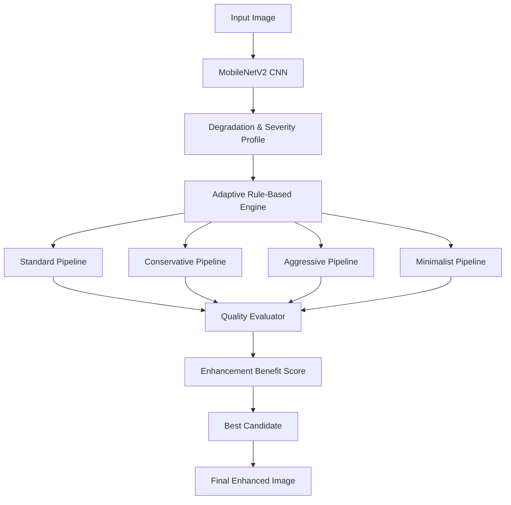

# Adaptive Quality-Aware Image Enhancement System 🖼️

An intelligent image enhancement system that automatically **detects image degradations, estimates their severity, generates multiple enhancement pipelines, and selects the best result using a no-reference image quality metric**.

The system combines **Deep Learning, Computer Vision, and rule-based optimization** to provide adaptive image enhancement rather than applying the same filters to every image.

---

## 🚀 Key Features

### 1. Multi-Label Image Degradation Detection

A fine-tuned **MobileNetV2** CNN analyzes an input image and independently detects multiple degradation types.

The model identifies:

* 🌑 Low Brightness
* 🌓 Low Contrast
* 📡 Noise
* 🌫️ Blur
* ☀️ Overexposure

The network uses `BCEWithLogitsLoss` for multi-label classification and produces a **severity profile** for the detected degradations.

---

### 2. Adaptive Enhancement Pipeline Generation

Instead of applying a fixed enhancement sequence, the system dynamically generates multiple candidate pipelines according to the detected degradation severity.

Candidate strategies include:

* **Standard** – Balanced enhancement
* **Conservative** – Minimal modification to preserve the original image
* **Aggressive** – Strong correction for severe degradations
* **Minimalist** – Applies only the most necessary corrections

This allows the system to adapt its enhancement strategy to each individual image.

---

### 3. No-Reference Image Quality Assessment

The system evaluates enhanced images without requiring a ground-truth/reference image.

A custom **Enhancement Benefit Score (EBS)** evaluates candidate results using factors such as:

* Sharpness
* Contrast
* Image quality improvement
* Artifact penalties

The candidate pipeline with the highest EBS is automatically selected as the final enhancement.

---

### 4. Interactive Streamlit Application

A web-based interface allows users to:

1. Upload an image
2. View detected degradations
3. View estimated severity
4. Generate enhancement candidates
5. Compare enhancement results
6. View the automatically selected result
7. Manually experiment with OpenCV enhancement filters

---

## 🧠 System Architecture



### Pipeline Overview

```text
Input Image
     │
     ▼
MobileNetV2 CNN
     │
     ▼
Degradation Detection
     │
     ▼
Severity Estimation
     │
     ▼
Adaptive Pipeline Generator
     │
     ├── Standard
     ├── Conservative
     ├── Aggressive
     └── Minimalist
             │
             ▼
      Quality Evaluation
             │
             ▼
       EBS Score Ranking
             │
             ▼
      Best Enhancement
             │
             ▼
       Final Image
```

---

## 📁 Project Structure

```text
ImageEnhancement/
│
├── app/
│   └── streamlit_app.py
│
├── src/
│   ├── cnn/
│   │   ├── baseline.py
│   │   ├── inference.py
│   │   └── mobilenetv2.py
│   │
│   ├── data/
│   │   └── generate_dataset.py
│   │
│   ├── enhancement/
│   │   └── library.py
│   │
│   ├── evaluation/
│   │   └── quality.py
│   │
│   ├── pipeline/
│   │   └── adaptive_selector.py
│   │
│   ├── preprocessing/
│   │   └── dataset.py
│   │
│   ├── recommendation/
│   │   ├── candidate_generator.py
│   │   ├── engine.py
│   │   └── severity_estimator.py
│   │
│   └── visualization/
│       └── eda.py
│
├── models/
│   └── # Trained model weights
│
├── data/
│   └── # Dataset files
│
├── README.md
└── requirements.txt
```

---

## 🛠️ Technologies Used

| Technology      | Purpose                          |
| --------------- | -------------------------------- |
| **Python**      | Core development                 |
| **PyTorch**     | CNN training and inference       |
| **MobileNetV2** | Image degradation classification |
| **OpenCV**      | Image enhancement operations     |
| **NumPy**       | Numerical image processing       |
| **Pandas**      | Dataset and data analysis        |
| **Matplotlib**  | Visualization                    |
| **Seaborn**     | Exploratory data analysis        |
| **Streamlit**   | Interactive web application      |

---

## ⚙️ Installation

### 1. Clone the repository

```bash
git clone https://github.com/YOUR_USERNAME/ImageEnhancement.git
cd ImageEnhancement
```

### 2. Create a virtual environment

```bash
python -m venv venv
```

Activate it on Windows:

```bash
venv\Scripts\activate
```

### 3. Install dependencies

```bash
pip install -r requirements.txt
```

If `requirements.txt` is not available, install the main dependencies:

```bash
pip install torch torchvision opencv-python numpy pandas matplotlib seaborn streamlit
```

---

## 🖥️ Running the Application

From the project root directory:

```bash
python -m streamlit run app/streamlit_app.py
```

The Streamlit application will open in your browser.

If the project directory contains spaces, use quotes:

```bash
cd "Image enhancement"
```

---

## 🔬 Methodology

The system follows a multi-stage pipeline.

### Step 1 — Image Analysis

The uploaded image is passed through the trained MobileNetV2 model.

The model predicts the presence and severity of:

```text
Brightness
Contrast
Noise
Blur
Overexposure
```

### Step 2 — Severity Profiling

The detected degradation probabilities are converted into a severity profile.

Example:

```text
Brightness     → High
Contrast       → Medium
Noise          → Low
Blur           → Medium
Overexposure   → None
```

### Step 3 — Candidate Generation

The adaptive recommendation engine uses the severity profile to generate appropriate enhancement pipelines.

For example:

```text
High Blur
   ↓
Sharpening + Denoising
```

or:

```text
Low Brightness + Low Contrast
   ↓
Brightness Correction
   ↓
Contrast Enhancement
```

### Step 4 — Quality Evaluation

Each generated candidate is evaluated using the custom Enhancement Benefit Score.

### Step 5 — Automatic Selection

The system compares the candidate scores and selects the pipeline with the highest score.

```text
Candidate A → EBS = 0.71
Candidate B → EBS = 0.84  ← Selected
Candidate C → EBS = 0.76
Candidate D → EBS = 0.69
```

The selected candidate becomes the final enhanced image.

---

## 📊 Enhancement Benefit Score

The **Enhancement Benefit Score (EBS)** is designed to evaluate enhancement quality without requiring a reference image.

Conceptually:

```text
EBS =
    Sharpness Contribution
  + Contrast Contribution
  - Artifact Penalty
```

This allows the system to compare multiple enhancement strategies and select the most beneficial result automatically.

---

## 🎯 Why This Approach?

Traditional image enhancement systems commonly apply a fixed sequence of filters.

For example:

```text
Input
 ↓
Brightness Adjustment
 ↓
Contrast Enhancement
 ↓
Sharpening
 ↓
Output
```

The problem is that the same pipeline may not work well for every image.

This project introduces an **adaptive approach**:

```text
Input
 ↓
Diagnose Image
 ↓
Understand Degradations
 ↓
Estimate Severity
 ↓
Generate Multiple Solutions
 ↓
Evaluate Solutions
 ↓
Select Best Solution
```

Therefore, the enhancement process is **image-dependent rather than fixed**.

---

## 🔮 Future Work

Potential improvements include:

* Train MobileNetV2 on larger and more diverse real-world datasets.
* Improve severity estimation using regression-based models.
* Introduce advanced deep-learning restoration models.
* Add **ESRGAN** or other super-resolution techniques.
* Improve no-reference IQA using established perceptual quality metrics.
* Add human evaluation to compare EBS with subjective image quality.
* Optimize inference speed for real-time applications.
* Deploy the Streamlit application as a cloud-based service.

---

## 📌 Applications

The system can potentially be used for:

* 📷 Automatic photo enhancement
* 🛰️ Image preprocessing
* 📱 Mobile photography
* 🏥 Medical image preprocessing
* 🚗 Computer vision preprocessing
* 📊 Image quality monitoring
* 🖼️ Digital image restoration

---

## 👨‍💻 Project Highlights

* **Deep Learning:** MobileNetV2-based multi-label degradation detection
* **Computer Vision:** OpenCV-based enhancement operations
* **Adaptive Decision Making:** Severity-aware pipeline generation
* **Quality Optimization:** No-reference Enhancement Benefit Score
* **Interactive Application:** Streamlit-based image enhancement interface

---

## 📜 License

This project is intended for academic and research purposes.

---

## ⭐ Project Summary

**Adaptive Quality-Aware Image Enhancement System** is an intelligent computer vision pipeline that **diagnoses image degradations using a multi-label CNN, generates multiple severity-aware enhancement strategies, evaluates their quality without a reference image, and automatically selects the best enhancement result.**
